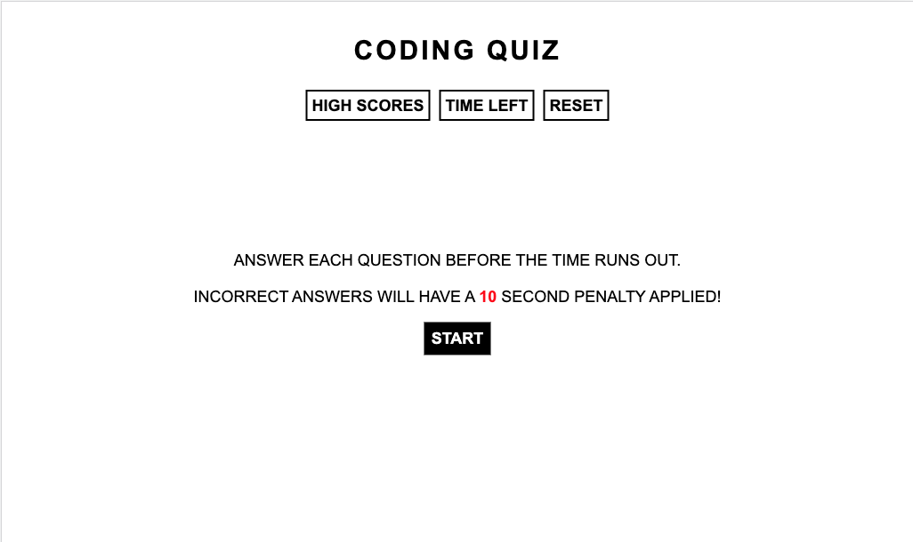
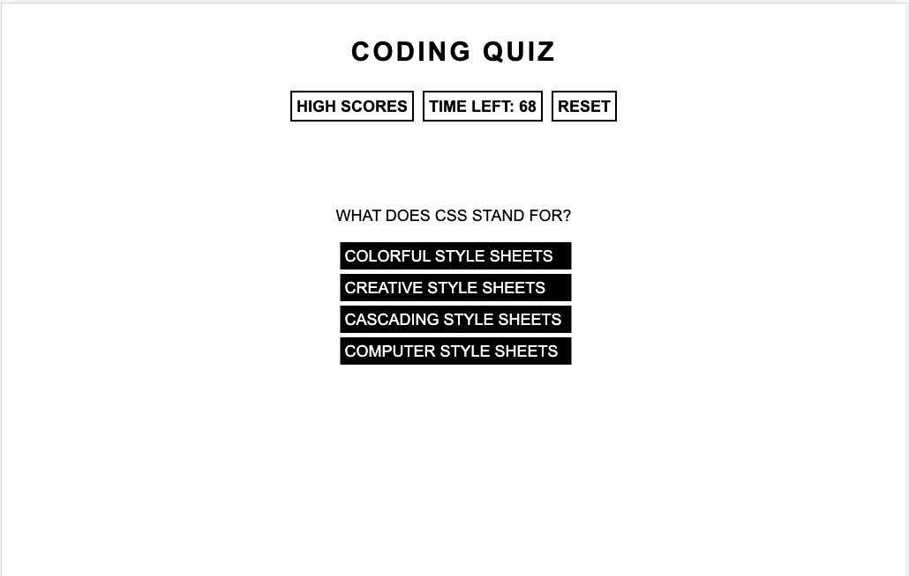
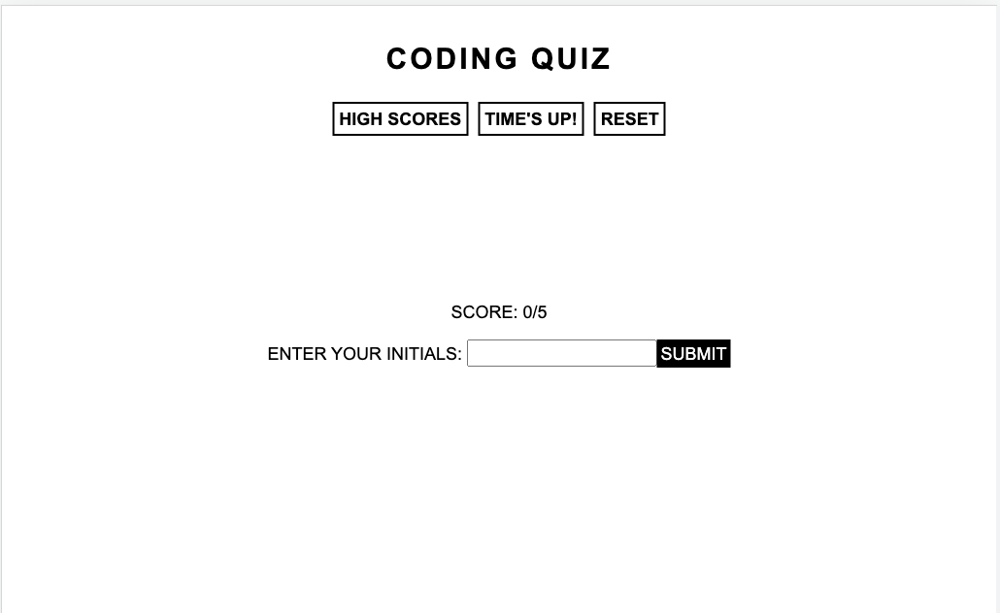
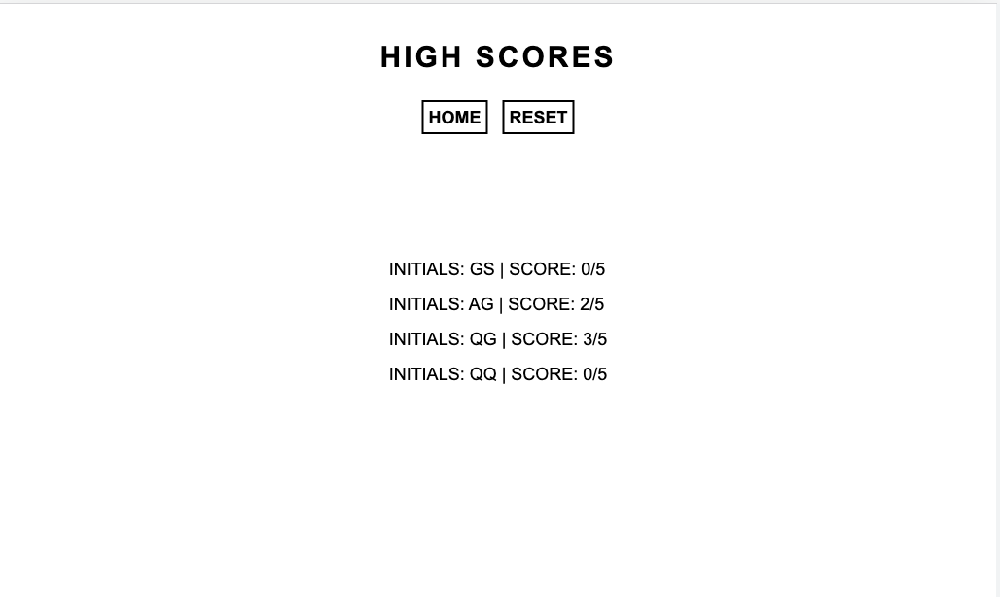
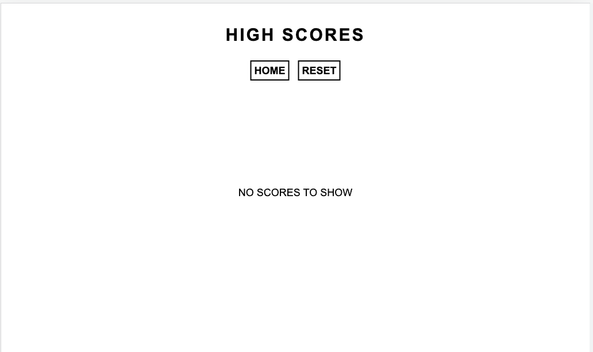

# Challenge 04

## Description
- This challenge was to create a functional quiz using HTML, CSS, and Javascript. 

## Functionality
- Home Page
  - When the start button is pressed, the countdown timer starts and the quiz questions are rendered onto the page.
  - The user will then have a predetermined amount of time to answer each of the questions.
  - When the user selects an answer, the next question will be displayed.
    - If the user selects the wrong answer, the user will receive a time penalty.
  - At the end of the quiz..
    - The countdown timer will stop.
    - The users score will be displayed and will be presented with an option to enter their initials.
    - At this time, the "Reset" button will become active and the user can choose to retake the quiz and restart the countdown timer.
    - If the user chooses to submit their score..
      - The user must provide an input otherwise an alert will pop up.
      - After the submit button is pressed, an alert will notify the user that their score has been submitted.
      - The user will be taken to the highscores page.

- High Score Page
  - The user can manually navigate to this page or be automatically redirected once they submit their initials.
  - This page will display all of the initial / scores stored in local memory.
    - If the local memory is empty, "No Scores to Display" will be shown.
  - If the user chooses, they can clear out the local memory using the "Reset" button.

### Website

### Link
[Quiz](https://ahuang23.github.io/C04_Quiz/)